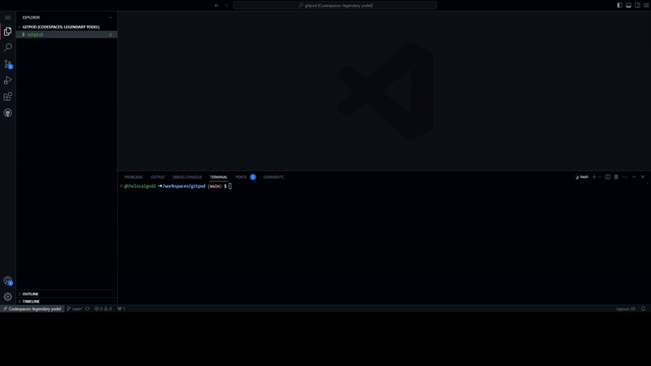

## auto install tailwind

this is a simple shell script for a fast installation of tailwind in a react project created with vite.

## Usage

1. Download the [file](tailwind.sh)
2. Copy it into the directory you wish to initialize the react app
3. run `bash tailwind.sh`
4. follow the prompt and done.

## tested with react project created with vite and Javascript

